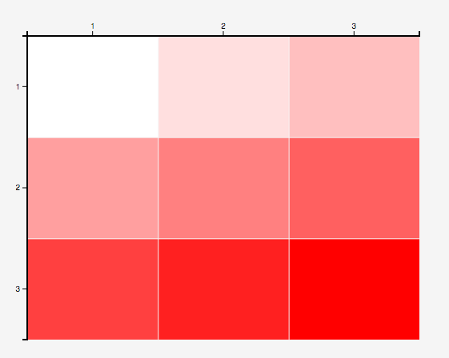
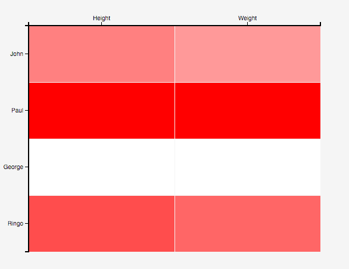

# D3 Heatmap

The heatmap module allows you to take your data frame or data tables and
represent their values as a colored table. The module exposes a completely
reusable d3 chart with user-editable properties, and it can handle two different
data formats.

## Creating & configuring a heatmap

Creating a heatmap works the same way as any other D3 reusable chart. You can
create a map like so:

```javascript
// Create the heatmap closure.
var myHeatmap = heatmap();
```

You may also want to configure certain visual properties of the heatmap. You
can set things like the width and height, the minimum and maximum color values,
and the transition duration.

```javascript
// Set chart properties on creation.
var myHeatmap = heatmap()
    .width(800)
    .height(1000);

/// Set chart properties post-creation.
myHeatmap.width(400)
    .minColor('yellow')
    .maxColor('red');
```

## Data formats

The heatmap chart can accept two different data formats: a data table or a
data frame.


A data table is a simple two-dimensional array that looks like so:
```javascript
var table = [
    [1, 2, 3],
    [4, 5, 6],
    [7, 8, 9],
    ...
];
```


The chart will place each element from the same array horizontally and on the
same vertical position. If the user does not specify the x and y labels to use
with this table, the chart will automatically place numbered ticks.

**Note: rows in data tables must all have the same length. The behavior of the
chart is undefined otherwise.**

A data frame is an array of objects with properties.
```javascript
var dataframe = [
    { Name: 'John', Height: 70, Weight: 160 },
    { Name: 'Paul', Height: 75, Weight: 190 },
    { Name: 'George', Height: 65, Weight: 140 },
    ...
];
```


The chart will use the first element from each object as the vertical axis
labels for the heatmap, and use all of the other properties as the horizontal
axis labels.

## Further help
For further information about using specific methods from the heatmap module,
refer to the `heatmap.js` file.
